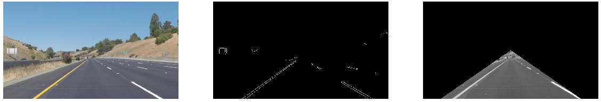
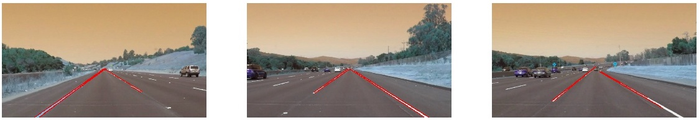

# **Finding Lane Lines on the Road** 
---
### Reflection

### 1. Describe your pipeline. As part of the description, explain how you modified the draw_lines() function.

My pipeline consisted of 6 steps. For each image in the test folder I iterated over these 6 steps. For a single image the proceduce is as follows.

- First, I converted the image to grayscale.
- I then applied a gaussian blur to minimize the noise in the image. I selected a kernel of size 9. This empirically seemed to work.
- Third step I used the canny edge detector algorithm to extract edges from the blurred image. I used a lower threshold of 100 and upper threshold of 200. Again from the images in the test folder these seemed to work well eliminating alot of the noise and getting the lanes.
- Fourth step was to select a region of interest that would emcompass the lanes on the road. I opted for a triangular region of interest whose peak is at a point half way the width of the image and base points were at $\frac{1}{10}$ from the edge of the image. This covers the lanes properly without the extra clutter of the items on the side of the road.


Images from the preprocessing part of the pipeline - the first is the original image, the second is the identification of edges in the image with canny edge detector. The third is the triangular region of interest mask on the grayscale image.

- Fifth step was to use the probabilistic hough transform to detect lines from the edges in the region of interest selected. I used the following parameters

	```
	- rho = 1 # distance resolution in pixels of the Hough grid    
	- theta = np.pi/180 # angular resolution in radians of the Hough grid.  
	- threshold = 50     # minimum number of votes (intersections in Hough grid cell)
	- min_line_length = 20 #minimum number of pixels making up a line
	- max_line_gap = 100    # maximum gap in pixels between connectable line segments
	```
- Final step was to draw the lines on the images using the original `draw_lines` function. Example images from the pipeline for processing the images in the test folder are shown below. 


Example images from running the pipeline on images in the test_images folder

### Drawing a single line on the lanes
In order to draw a single line on the left and right lanes, I modified the draw_lines() in three ways

- Step 1: I selected out lines which represent the left lane and those that represent the right lane. This was done by looking at the gradient of each line. For the left lane lines `(y2-y1)/(x2-x1) < 0` and for the right lane lines `(y2-y1)/(x2-x1) > 0`.
- Step 2: I then averaged each set of lines for the left lane and the right lane getting a single representative line for each lane.
- Step 3: Final step was to extrapolate these lines to originate from the base of the image upto about the middle of the image where the lanes vanish. To do this I calculated the y-intercept for both resultant lines from Step 2 and used the formula of a line `y = Ax + B` to calculate the points where the line has values

	```
	* Left lane line: y1 = width_of_image and x2 = 0.45 x length_of_image 
	* Right lane line: y2 = width_of_image and x1 = 0.55 x length_of_image

	```


Depiction of the full pipepline with solid lines for the driving lanes

### 2. Identify potential shortcomings with your current pipeline


One potential shortcoming would be if the light intensity or material of the road were different from the one trained on, then it would be difficult for this current pipeline to identify the lanes

Another shortcoming could be for some areas of the road where the markings are too few or out of the range of the parameters specified in the Hough transform then the lane would not be identified.


### 3. Suggest possible improvements to your pipeline

A possible improvement would be to particularly try and detect the color of the markings. Since we know the markings are always yellow and white, we could use for example the `cv2.inRange` function to select out regions on the road where we see these colors.

Another potential improvement could be to use the geometry of the road and the lanes to always predict the location of the missing lane in the case where we cant detect one of the lanes.

Another potential improvement could be to keep a mean location for each of the lanes based on previous frames of the video and use that to predict the lane in a new frame particularly if the lane predicted using the computer vision algorithms varys significantly from the "mean lane" as is the case in the challenge section of the project.
